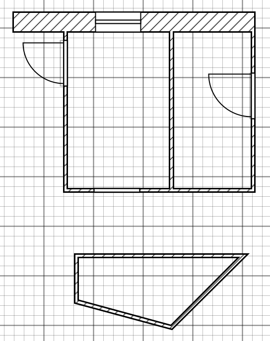
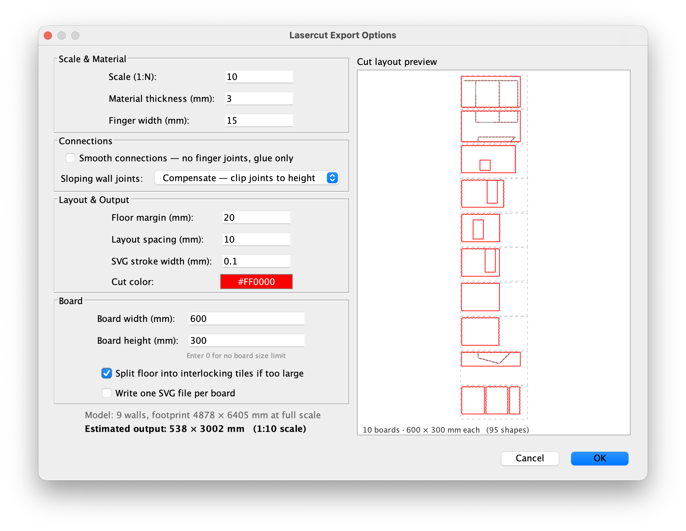

# Sweet Home 3D Laser Cut Export Plugin

A Sweet Home 3D plugin that exports a level as flat cut files (SVG and/or DXF)
ready for laser cutting. Walls become interlocking pieces with box-joint fingers
on the bottom edge that slot into the floor plate, with optional finger joints
where walls meet each other.

You go from this:



To this:



## Features

- Adds **Tools → Export to lasercut SVG…** to Sweet Home 3D.
- Exports the currently selected level (or all walls when no levels exist).
- All wall thicknesses in the model are replaced by one user-defined material
  thickness so every piece is consistent for a single sheet.
- Generates one panel per wall and one combined floor plate.
- Floor plate has rectangular slots aligned with each wall's bottom fingers.
- Doors and windows cut rectangular openings sized and positioned to match the
  model. Doors that reach the floor also remove bottom fingers that would dangle
  in the opening.
- **Sloping wall support**: walls with different start and end heights get a
  diagonal top edge (trapezoid). Where a sloping wall meets another wall you
  can choose **Compensate** (tabs clipped to the shorter height) or **Smooth**
  (no tabs on the sloping end, glue/trim instead).
- **Angled corner support**: for non-90° wall junctions the tab depth and panel
  inset are scaled by 1/sin(θ) so fingers span exactly one material thickness
  regardless of the meeting angle.
- **T-junction notches**: when a wall butts into the face of another the
  receiving wall gets matching slots so both pieces interlock.
- **Cross (+) junction support**: when two walls pass through each other at a
  point that is not a shared endpoint, each gets a half-depth slot so they
  slide together in 3D assembly.
- **Wall placement guides**: gray reference outlines on the floor plate show
  where each wall sits, making assembly easier.
- **Kerf compensation**: automatically offsets cut paths so physical pieces
  match designed dimensions after the laser beam removes material. Outer
  profiles expand by half the kerf; inner cuts (slots, openings) shrink by
  half the kerf.
- **Bridge / holding tabs**: small uncut sections in outer profiles keep pieces
  attached to the sheet during cutting. You snap them out by hand afterwards.
- **Inner cuts before outer profiles**: slots and openings are emitted first in
  the file so pieces don't shift when their boundary is freed.
- Optional **smooth wall connections**: walls have straight vertical edges and
  only the floor holds them in place (useful when corners will be glued or
  trimmed rather than interlocked).
- **Board size layout**: set physical board dimensions and the exporter packs
  all pieces onto as many boards as needed using MaxRects BSSF bin-packing.
  Pieces are tried in both orientations; the one that wastes less space is used.
- **Multi-board output**: each board can be written as its own file
  (`<name>-board1.svg`, `<name>-board2.svg`, …).
- **Floor tile splitting**: when the floor plate spans multiple boards it is
  split into tiles joined by dovetail puzzle-piece tabs that lock sideways but
  slide apart lengthwise for assembly.
- **SVG and DXF output**: choose SVG, DXF, or both. DXF uses R2000 LWPOLYLINE
  entities on named layers (`CUT`, `REF`, `BOARD`) so it imports cleanly into
  any CAD or laser-driver software.
- Live preview of the cut layout in the options dialog, including board
  boundaries, bridge gaps, inner cuts, piece count, and board dimensions.
- Configurable cut stroke color (default `#FF0000`) and SVG stroke width.

## Install

Grab the latest pre-built plugin here:
[Download `LasercutExport.sh3p`](https://github.com/DrSkunk/sh3d-lasercut-export/releases/latest/download/LasercutExport.sh3p)

Then in Sweet Home 3D open **File → Preferences → Plug-ins → Import…** and pick
the downloaded `.sh3p`. Restart Sweet Home 3D. The new entry appears under the
**Tools** menu.

Alternatively, drop the `.sh3p` file into Sweet Home 3D's `plugins` folder:

- macOS: `~/Library/Application Support/eTeks/Sweet Home 3D/plugins/`
- Linux: `~/.eteks/sweethome3d/plugins/`
- Windows: `%APPDATA%\eTeks\Sweet Home 3D\plugins\`

## Using

1. Select the level you want to export in Sweet Home 3D.
2. **Tools → Export to lasercut SVG…**
3. Adjust settings in the dialog (described in full below) and watch the live
   preview update.
4. Click **OK**, choose an output file, and click **Save**.

### Settings reference

#### Scale & Material

| Setting | Description |
|---------|-------------|
| **Scale 1:N** | Shrinks the model by factor N so it fits a physical sheet. A 5 m wall at 1:50 becomes 100 mm on the cut sheet. Affects all model-derived dimensions. Does **not** affect material thickness, finger width, margins, or spacing — those are entered in real physical millimetres. |
| **Material thickness (mm)** | The physical thickness of the sheet you are cutting. Every wall and the floor use this value; individual wall thicknesses in the model are ignored. |
| **Finger width (mm)** | Target width of each box-joint finger or slot. The actual width is rounded so that an odd number of equal fingers fits the edge exactly (a finger at each end, with slots between). |

#### Connections

| Setting | Description |
|---------|-------------|
| **Smooth connections** | When checked, no box-joint tabs are generated anywhere — walls have plain straight edges on all sides and the floor plate has no slots. Intended for glued or press-fit assemblies. |
| **Sloping wall joints** | Controls how tab height is calculated where a sloping wall (one with different heights at each end) meets a neighbour. **Compensate** clips the tabs to the shorter height at that junction so they always fit within both panels. **Smooth** suppresses tabs entirely on those edges, leaving a straight cut for gluing. |

#### Layout & Output

| Setting | Description |
|---------|-------------|
| **Floor margin (mm)** | Extra clear space added around the wall footprints on all sides of the floor outline. |
| **Layout spacing (mm)** | Minimum gap between pieces in the SVG layout, and the inset from the board edge to the nearest piece when board dimensions are set. |
| **SVG stroke width (mm)** | Width of cut lines written into the SVG file. Use `0` or `0.1` for a hairline; your laser driver treats this as a vector cut. Has no effect on DXF output. |
| **Cut color** | Stroke color of cut lines in the SVG (default red `#FF0000`). Many laser-driver applications use color to assign power / speed profiles. DXF output uses the `CUT` layer instead of a color attribute. |
| **Export format** | **SVG** — writes one `.svg` file (or one per board). **DXF** — writes one `.dxf` file in AutoCAD R2000 format with layers `CUT`, `REF`, and `BOARD`. **SVG + DXF** — writes both files side by side. |

#### Cut Quality

| Setting | Description |
|---------|-------------|
| **Kerf compensation (mm)** | Width of material the laser removes in one pass (the "kerf"). When set, outer profiles are expanded by half this value and inner cuts (slots, door openings) are shrunk by half this value, so finished pieces match the designed dimensions. Set to `0` to disable. Typical values are 0.1–0.5 mm depending on laser and material. |
| **Bridge width (mm)** | Length of each uncut holding tab left in outer profiles. Bridges keep pieces attached to the sheet during cutting so they don't fall or shift. After cutting, snap them out by hand and sand or file the nubs. Set to `0` to disable. A value of 3–5 mm works well for most materials. |
| **Bridges per edge** | How many bridges to insert on each long edge of a piece. Short edges (less than three times the bridge width) are not bridged. More bridges mean more holding strength but more cleanup. |

#### Board

| Setting | Description |
|---------|-------------|
| **Board width / height (mm)** | Physical dimensions of your laser-cutting bed or material sheet. Leave both at `0` to place all pieces in a single unbounded layout. When set, the exporter packs pieces onto as many boards as needed and warns if any single piece exceeds the board size. |
| **Split floor into interlocking tiles** | When the floor plate is wider or taller than the board, split it into a grid of tiles joined by locking puzzle-piece tabs at the seams. Only available when board dimensions are set. |
| **Write one file per board** | When board dimensions are set, write a separate SVG and/or DXF file for each board rather than one combined file. File names get a `-board1`, `-board2`, … suffix. |

## How the geometry works

Sweet Home 3D walls are consolidated to one thickness `T` and laid flat:

- Each wall becomes a rectangle `length × height`. **Fingers protrude downward**
  by `T` at regular intervals along the bottom edge.
- Sloping walls (different start and end heights) get a **trapezoidal** outline
  with a diagonal top edge.
- The floor plate covers all wall footprints. **Rectangular slots** are cut
  through it at each wall's world-coordinate position; slot positions match the
  finger pattern exactly so each finger passes through the floor.
- At **90° corners** where two walls share an endpoint and smooth connections
  is off, both walls receive complementary finger patterns on their meeting
  edges. At **non-90° corners** the tab depth is scaled by `T / sin(θ)` and the
  panel is inset by `T / (2 sin(θ))` so the tabs always span exactly one
  material thickness across the joint.
- At **T-junctions** (one wall butting into the face of another) the receiving
  wall gets notch slots that accept the butting wall's fingers.
- At **cross (+) junctions** (two walls whose centrelines intersect at a point
  that is not a shared endpoint) each wall gets a half-depth slot — the primary
  wall from mid-height to the top, the secondary from the bottom to mid-height —
  so the two panels slide together like a half-lap joint.
- **Kerf compensation** works by offsetting each polygon edge outward or inward
  by `kerf / 2`, then re-intersecting adjacent offset edges to compute new
  vertices. This correctly handles convex tab tips (which expand further out)
  and concave slot roots (which widen) without distorting the shape.
- **Bridge gaps** divide each long outer edge into equal sub-spans and leave a
  small uncut section in the middle of each span. Edges shorter than three times
  the bridge width are not bridged.
- When **board dimensions** are set, pieces are arranged with MaxRects BSSF
  (Best Short Side Fit) bin-packing. Each piece is tried in its natural
  orientation and rotated 90°; whichever leaves the smaller leftover dimension
  is used. When the floor plate spans a board boundary it is split into tiles
  joined by **dovetail puzzle tabs** that lock sideways but slide lengthwise.
- **Inner cuts** (slots, openings) are emitted in the file before outer profiles
  so panels do not shift when their boundary is freed during cutting.
- **DXF output** uses R2000 LWPOLYLINE entities. Cut paths go on layer `CUT`
  (ACI color 1 = red), reference outlines on `REF` (color 8 = gray), and board
  outline rectangles on `BOARD` (color 8). `$INSUNITS` is set to 4 (mm) so
  importing applications use the correct unit automatically.
- Finger polarity (which wall gets gap-first vs. tab-first at a shared corner)
  is decided by `System.identityHashCode` order, which is stable within a
  session but may differ between runs.

## Limitations

- Only straight walls are supported; arc walls are treated as straight from
  start to end.
- The floor outline follows the axis-aligned bounding box of the wall
  footprints; complex concave room shapes may produce an oversized floor plate.

## License

GPL v2 or later, matching the Sweet Home 3D plugin SDK.

---

## Build from source

You need a JDK (8 or newer) and Apache Ant (or use the bundled `Makefile`).

1. Drop a `SweetHome3D.jar` into the `lib/` directory, **or** pass its path on
   the command line. On macOS the jar lives inside the app bundle:

   ```
   /Applications/Sweet Home 3D.app/Contents/Java/SweetHome3D.jar
   ```

2. Build:

   ```sh
   make          # uses lib/SweetHome3D.jar if present
   # or
   ant -Dsh3d.jar="/Applications/Sweet Home 3D.app/Contents/Java/SweetHome3D.jar"
   ```

3. The plugin file is written to `dist/LasercutExport.sh3p`.
   Install it with `make install`.

| Target              | Description |
|---------------------|-------------|
| `make clean`        | Remove `build/` and `dist/`. |
| `make install`      | Build (if needed) and copy the `.sh3p` into your local Sweet Home 3D plugins folder (path auto-detected per OS). |
| `make reinstall`    | Shorthand for `make clean install`. |
| `make run`          | Launch Sweet Home 3D (macOS only). |
| `make print-config` | Show the resolved values of `SH3D_JAR`, `SH3D_PLUGIN_DIR`, and the output `.sh3p` path. |
